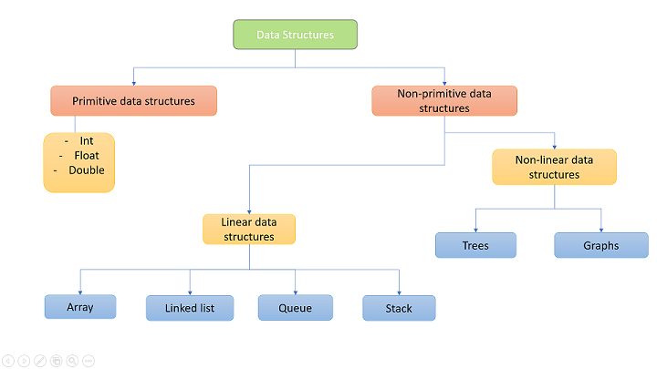
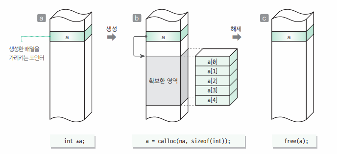
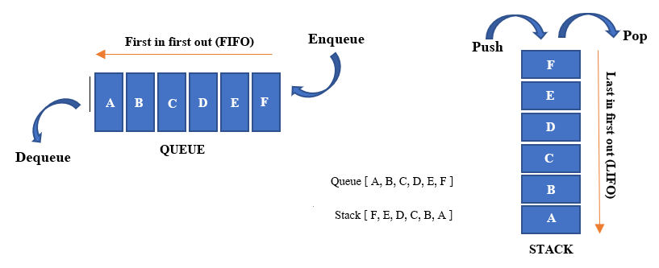
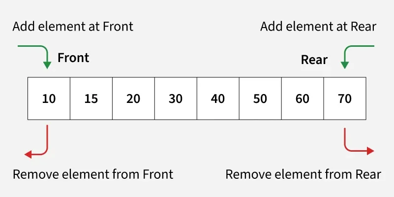
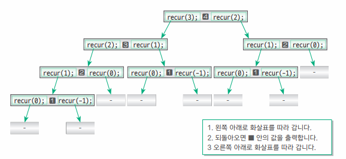
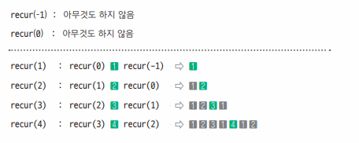

# iot-algorithm-2026
IoT개발자 과정 자료구조/알고리즘 리포지토리

## 개요

### 자료구조

- 정의
    - 데이터를 구성하는 구조
        - 데이터를 원하는 요구에 따라 처리할 때 효율적으로 처리하기 위함
    - 자료(Data) + 구조(Structure) -> DataStructure
    - 자료형(DataType) : int, double, char...
    - 자료구조(DS) : 배열, 구조체...
    - 주소록 -> 구조체로 구성된 배열(크기 고정), `구조체 포인터`(크기 동적 조정가능)

- 종류
    - 단순형 : 문자, 정수, 실수, 문자열...
    - 선형 : 배열, `리스트`, `스택`, `큐`
    - 비선형 : `트리`, `힙`, `그래프`
    - 파일 : 순차파일, 색인파일...

### 알고리즘

- 정의
    - 알고리즘 `Algorithm`
    - 프로그램 : 데이터를 처리하는 소프트웨어
    - `데이터를 처리할 때 문제를 해결하는 논리적인 방법과 순서`

- 필요요건
    - 입력 : 알고리즘 외부에서 제공되는 자료가 필요
    - 출력 : 최소 1개 이상의 결과 도출 필요
    - 명확성 : 각 단계가 애매함이 없어야 함
    - 유한성 : 유한한 횟수를 거친 후 문제 해결, 종료
    - 효과성 : 유한한 시간안에 수행할 수 있을 정도로 단순

- 복잡도 - 시간과 메모리를 얼마나 소모하는지 효율성을 따지는 척도
    - `시간 복잡도` : 자료수 n이 증가할 때 시간이 얼마만큼 증가하는지 판단
    - 공간 복잡도 : 자료수 n이 증가할 때 컴퓨터 메모리를 얼마만큼 사용하는지 판단
                - 임베디드/펌웨어에서는 중요!

- 종류 - 자료구조를 가지고 해결하는 방법
    - `검색` : 특정 데이터 찾기, 선형 검색, 이진 검색
    - `재귀` 알고리즘
    - `정렬` : 삽입, 선택, 버블, 셸, 퀵, 병합, 힙...
    - `문자열 검색` : 부루트-포스, KMP, 보이어-무어...
    - `탐색` : DFS(깊이 우선 탐색), BFS(너비 우선 탐색), 이진 탐색
    - `그래프` : 다익스트라, 벨먼-포드, A*
    - 그리디 알고리즘, 백트래킹, 분할 정복 
    - 동적계획법 : 메모이제이션
    - 인공지능 : 신경망, SVM(서포트 벡터 머신), 회귀분석...
    - 운영체제 : 세마포어, 뮤텍스, 데드락, 멀티태스킹, 멀티스레드
    - 네트워크 : QoS, 라우팅, ...
    - 암호화 : AES, DES, SEED, MD5, RSA...

- 참조 웹사이트
    - https://blog.amigoscode.com/p/11-data-structures-every-developer

- 현재 IT개발에서 직접 알고리즘을 개발할 일은 거의 없음
    - 특정 개발시 어떠한 자료구조와 어떤 알고리즘을 쓰는 게 효과적인지를 습득하기 위해서
    - 미리 만들어진 알고리즘을 잘 활용하면 됨

### 자료구조/알고리즘 예제

1. 알고리즘 핵심
    - 순서도와 연결 : [소스](./basic/algorithm01/app02/app02.c) 

2. 메모리 구조
    - 코드 영역 - 소스코드가 저장되는 부분, 컴파일 후 실행될 때 할당
    - 데이터 영역 - 전역·정적 변수 할당, 프로그램 시작시 할당되고 종료시 메모리 해제 
    - 스택 영역 - 함수 호출시 생성되는 지역변수·매개변수 저장, 함수 호출 완료시 메모리 해제
    - `힙 영역` - 동적으로 메모리 할당 (malloc, calloc, realloc 와 연계)

        

3. 자료구조
    - 배열 : 같은 자료형의 묶음
    - 동적할당 : [소스](./basic/algorithm01/app03/app03.c)
    - 포인터 연습(1-5) : [소스](./basic/algorithm01/pointer01/pointer01.c)

4. 알고리즘 필요성 
    - 난수 : [소스](./basic/algorithm01/app04/app04.c)
    - 소수 : [소스](./basic/algorithm01/app06/app06.c)
        - 같은 답을 얻는 알고리즘은 하나가 아님
        - 빠른 알고리즘은 메모리를 많이 사용 

### 검색 알고리즘

1. 검색 - Search, 데이터 집합에서 원하는 값을 가진 요소를 찾아내는 것

2. 선형 검색 : [소스](./basic/algorithm02/app01/app01.c)
    - 배열의 모든 요소를 순착적으로 검색
    - 찾는 요소가 있으면 그 위치에서 빠져나감
    - [단점] 찾는 요소가 없으면 배열의 마지막까지 비교

3. 이진 검색 : [소스](./basic/algorithm02/app02/app02.c)
    - 찾는 요소가 있든 없든 검색횟수가 비약적으로 줄어듦
    - [단점] 데이터가 키값으로 이미 정렬(sort) 되어 있다는 가정하에서 시작

4. 복잡도(Complexity)
    - 시간 복잡도 : 실행에 필요한 시간을 평가
        
        - [간단내용참조](https://namu.wiki/w/%EC%8B%9C%EA%B0%84%20%EB%B3%B5%EC%9E%A1%EB%8F%84)
        - [복잡내용참조](https://ko.wikipedia.org/wiki/%EC%8B%9C%EA%B0%84_%EB%B3%B5%EC%9E%A1%EB%8F%84)

    - 공간 복잡도 : 기억 영역, 파일 공간 등 물리적인 공간을 얼마나 필요하는지 평가
    - 복잡도 표현 함수 : O(영문자 대문자 오, 빅오)
    - 선형 검색 시간 복잡도 : $O(n)$
    - 이진 검색 시간 복잡도 : $O(log n)$
    - 시간복잡도 일반적 사용
    
        |시간복잡도|의미|비고|
        |:--|:--|:--|
        |$O(1)$| 상수 시간 | 입력크기와 관계없이 항상 일정횟수 실행 |
        |$O(log n)$| 로그 시간 | 반복문 안의 로직으로 반복 횟수가 $\frac{1}{2}$씩 줄어들 때, $1$-> $\frac{1}{2}$ -> $\frac{1}{4}$ -> $\frac{1}{8}$ ... 문제 크기를 절반씩 줄이며 실행 |
        |$O(n)$| 선형 시간 | 단일 반복문 / 입력 크기만큼 한 번 순회 |
        |$O(nlogn)$| 선형 로그시간 | n번 반복하면서 내부에서 log n연산 수행, 분할정복 기반 정렬 등 사용 |
        |$O(n^2)$| **이차 시간** | 이중 반복문 / 이 이상은 실무에서 나오면 속도가 아주 느려짐 |
        |$O(n^3)$| 삼차 시간 | 삼중 반복문 |
        |$O(n k)$| 선형x다른변수 | n과 k가 독립변수일 때 / 문자열 비교 n개 x 길이 k 문자열 배열 처리 ...|
        |$O(2^n)$| 지수 시간 | 재귀! 모든 부분집합 탐색 등 |
        |$O(n!)$| 팩토리얼 | 

    - 예 : n이 30이면     
        |시간복잡도|연산횟수|
        |:--|--:|
        |$O(1)$    |1| 
        |$O(log n)$|약 5| 
        |$O(n)$    |30|
        |$O(nlogn)$|약 150 (30 x 5)|
        |$O(n^2)$  |900 (30²)|
        |$O(n^3)$  |27,000 (30³)| 
        |$O(n k)$  |30k(900) (k = 30)| 
        |$O(2^n)$  |$2^{30}$ = 1,073,741,824 (약 10억)|
        |$O(n!)$   |30! = 약 2.65 x $10^{32}$|

    - 공간복잡도
        - $O(1)$   - 변수 몇 개
        - $O(n)$   - 1차원 배열, 재귀 깊이 n
        - $O(n^2)$ - 2차원 배열

5. bsearch() 표준라이브러리 이진검색 함수 존재
    - 두 값 비교를 위한 함수포인터용 비교함수를 작성해야 함
    - p123 이후 참조

### 현재 과정 학습 로드맵

1. 언어
    - `C`, C++, SQL, Python, C#, HTML, CSS, JS

2. 기술
    - `프로그래밍 기본`, `알고리즘`, 통신프로그램, 데이터분석, 웹개발, 윈앱개발, IoT

### 스택과 큐 자료구조

1. `스택` : [소스](./basic/algorithm02/app03/app03.c)
    
    (1) 정의
    - 한쪽 끝이 막혀있는 접시를 쌓는 구조와 동일한 자료구조
    - 맨 처음에 쌓인 접시는 위의 쌓여있던 접시가 모두 제거되어야 꺼낼 수 있음
    - LIFO(Last In First Out) - 후입선출(가장 나중에 들어온 데이터가 먼저 사용됨)

    (2) 용어 [소스](./basic/algorithm02/app03/IntStack.h)
    - push : 스택에 데이터 삽입
    - pop : 스택에서 데이터 꺼내는 작업
    - peek : 스택의 가장 마지막에 들어있는 데이터를 확인
    - bottom : 스택의 가장 바닥
    - top : 스택의 가장 위

2. `큐` : [소스](./basic/algorithm03/app01/app01.c)

    (1) 정의
    - 양쪽이 다 열려있어서 한쪽에서 데이터를 추가 / 반대에서 데이터를 꺼내는 자료구조
    - 실생활 예 : 영화관 티켓줄, 버스 대기줄, 식당 대기줄 ..
    - 컴퓨터 예 : 파일입출력 스트림, 프린터 출력대기(Pool), 게임키보드 입력순서버퍼 ..
    - FIFO(First In First Out) - 선입선출(먼저 들어온 데이터가 먼저 사용됨)

    (2) 용어 : [소스](./basic/algorithm03/app01/IntQueue.h)
    - enqueue : 큐의 끝에 데이터 삽입 작업
    - dequeue : 큐의 앞에서 데이터 추출 작업
    - front : dequeue를 수행할 큐 맨 앞자리 
    - rear : enqueue를 수행할 큐 맨 뒷자리

3. 큐를 배열로 구현시 단점
    - dequeue를 실행하면 배열 맨 앞자리가 빔
    - 빈자리를 뒤의 데이터로 채우는 부가작업 필요 : O(n)
    - 보통 큐는 배열보다 연결리스트로 구현 또는 원형큐(링버퍼)로 구현 

4. `원형큐` : [소스](./basic/algorithm03/app01/IntQueue.c)
    - 일반큐 단점(빈자리 없애기 추가 로직)을 없앤 큐
    - (front + i) % max에 대해서 이해할 것!

5. Deque(데크)
    - 스택과 큐를 합친 특이한 자료구조
    - 앞에서 인큐, 디큐, 뒤에서 인큐, 디큐가 모두 가능한 구조
    
    

### 재귀 알고리즘

1. 의미
    - Recursive(재귀) 
    - 사전적: 본디의 곳으로 다시 돌아오는 것 
    - 함수(or 알고리즘)에서 자기 자신의 함수를 호출하여, 더 작은 하위 문제를 해결하는 프로그램 기법

2. 팩토리얼
    - 재귀 호출 : [소스](./basic/algorithm03/app02/app02.c)
    - 비재귀 호출 : [소스](./basic/algorithm03/app03/app03.c)

3. 재귀 분석 : [소스](./basic/algorithm03/app04/app04.c)

    - 하향식 분석 : 트리형태로 분석
        

    - 상향식 분석 : 표/점화식 전개 분석     
        

    - recur(5) 풀이: recur(4) `5` recur(3) -> 1 2 3 1 4 1 2 5 1 2 3 1

4. 재귀 알고리즘 비재귀적으로 변경 : [소스](./basic/algorithm03/app05/app05.c)
    - 스택 자료구조 사용
    - 재귀호출이 처리속도를 느리게 만드는 경우가 많음
    - 비재귀적으로 변경하면 속도향상에 도움됨

5. `메모이제이션!`
    - 특정 조건(재귀, 동일한 부분문제 반복, 입력크기 규모)에서 매우 강력한 성능 향상 기법
    - 이미 계산한 결과를 저장해두고 다시 호출하면 재계산하지 않고 바로 반환
    - 동적계획법에 많이 사용

### 정렬 알고리즘

### 문자열 검색 알고리즘

### 리스트 자료구조

### 해시 자료구조